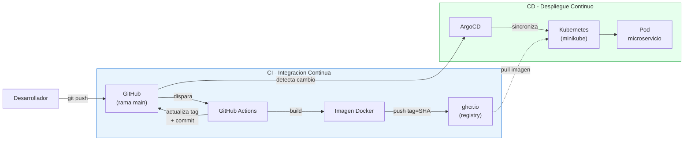

# k8s-microservice

Microservicio desplegado en Kubernetes mediante un flujo **GitOps** completamente automatizado, usando Docker, Helm, ArgoCD y un pipeline de CI/CD con GitHub Actions.

Proyecto desarrollado para el taller de Arquitectura de Software (Trabajo K8S).

---

## Tabla de contenido

1. [Objetivo](#objetivo)
2. [Arquitectura](#arquitectura)
3. [Stack tecnológico](#stack-tecnológico)
4. [Estructura del proyecto](#estructura-del-proyecto)
5. [Flujo CI/CD + GitOps](#flujo-cicd--gitops)
6. [Decisiones técnicas](#decisiones-técnicas)
7. [Evolución futura](#evolución-futura)
8. [Cómo reproducirlo](#cómo-reproducirlo)
9. [Endpoints](#endpoints)

---

## Objetivo

Demostrar el despliegue automatizado de un microservicio individualmente desplegable, aplicando contenedores Docker, orquestación con Kubernetes, gestión de paquetes con Helm, entrega continua con ArgoCD (GitOps) y automatización del ciclo mediante pipelines de CI/CD.

El microservicio es intencionalmente simple: el foco del proyecto está en la **infraestructura de despliegue**, no en la lógica de negocio.

---

## Arquitectura

El sistema implementa el patrón **GitOps**, donde el repositorio Git es la única fuente de verdad. Cualquier cambio en el código desencadena un flujo automatizado que termina con la nueva versión corriendo en el clúster, sin intervención manual.



El flujo se divide en dos responsabilidades:

- **CI (Integración Continua):** GitHub Actions construye la imagen, la publica en el registry y actualiza la definición del despliegue en Git.
- **CD (Despliegue Continuo):** ArgoCD detecta el cambio en Git y sincroniza el clúster, desplegando la nueva versión.

El puente entre ambas es el commit automático que el pipeline hace sobre `chart/values.yaml`.

---

## Stack tecnológico

| Tecnología | Rol en el proyecto |
|------------|--------------------|
| **Node.js + Express** | Microservicio base con endpoints de salud e información |
| **Docker** | Empaquetado del microservicio en una imagen portable |
| **Kubernetes (minikube)** | Orquestación de contenedores en clúster local |
| **Helm** | Empaquetado parametrizable de los manifiestos de Kubernetes |
| **ArgoCD** | Entrega continua basada en GitOps |
| **GitHub Actions** | Pipeline de CI/CD |
| **GitHub Container Registry (ghcr.io)** | Almacenamiento de las imágenes Docker |

---

## Estructura del proyecto

```
k8s-microservice/
├── .github/
│   └── workflows/
│       └── release.yml          # Pipeline de CI/CD (GitHub Actions)
├── chart/                       # Helm chart
│   ├── Chart.yaml               # Metadatos del chart
│   ├── values.yaml              # Valores por defecto
│   ├── values-dev.yaml          # Override para desarrollo
│   ├── values-prod.yaml         # Override para producción
│   └── templates/
│       ├── deployment.yaml      # Plantilla del Deployment
│       └── service.yaml         # Plantilla del Service
├── src/
│   └── server.js                # Código del microservicio
├── Dockerfile                   # Receta de construcción de la imagen
├── .dockerignore
├── .gitignore
└── package.json
```

---

## Flujo CI/CD + GitOps

El ciclo completo, paso a paso:

1. **Commit:** se hace push de un cambio a la rama `main`.
2. **Disparo:** GitHub Actions detecta el push y ejecuta el pipeline.
3. **Build:** se construye la imagen Docker a partir del `Dockerfile`.
4. **Push:** la imagen se publica en `ghcr.io` etiquetada con el SHA del commit.
5. **Update:** el pipeline actualiza el campo `tag` en `chart/values.yaml` con ese SHA.
6. **Commit automático:** el pipeline hace commit de ese cambio de vuelta al repositorio.
7. **Detección:** ArgoCD, con auto-sync activado, detecta el cambio en Git.
8. **Despliegue:** ArgoCD sincroniza el clúster y despliega la nueva versión.

Todo el proceso ocurre sin intervención manual una vez hecho el commit inicial.

---

## Decisiones técnicas

### Tagging de imágenes con el SHA del commit

Las imágenes se etiquetan con el SHA del commit en lugar de versiones semánticas estáticas. Esto aporta:

- **Trazabilidad:** cada imagen queda atada a un commit exacto, permitiendo saber con certeza qué código contiene.
- **Inmutabilidad:** un SHA nunca se repite, evitando sobrescrituras accidentales de versiones.
- **Rollbacks deterministas:** revertir es tan simple como referenciar el SHA de una versión previa.
- **Automatización total:** el tag se genera solo, sin requerir decisiones humanas sobre el versionado.

Como contrapartida, los SHA no son legibles para humanos; en un entorno de producción se complementarían con versiones semánticas en los releases oficiales.

### Overrides de Helm por entorno

El chart define valores por defecto en `values.yaml` y permite personalizarlos por entorno mediante `values-dev.yaml` y `values-prod.yaml`. Por ejemplo, producción usa más réplicas y mayores límites de recursos que desarrollo, sin modificar las plantillas.

### Health checks

El microservicio expone un endpoint `/health` usado por las probes de **liveness** y **readiness** de Kubernetes, permitiendo que el orquestador detecte y recupere automáticamente instancias no saludables.

### Buenas prácticas en el Dockerfile

La imagen usa una base ligera (`node:20-alpine`), ejecuta como usuario no-root por seguridad, y aprovecha el cacheo de capas instalando dependencias antes de copiar el código fuente.

### Auto-sync con prune y self-heal

ArgoCD está configurado con sincronización automática, **prune** (elimina recursos que ya no están en Git) y **self-heal** (revierte cambios manuales en el clúster para mantener la coherencia con Git).

### Optimización del disparo del pipeline

El pipeline ignora cambios sobre `chart/values.yaml` y `README.md` mediante `paths-ignore`. Ignorar `values.yaml` es **necesario** para evitar un bucle infinito: como el propio pipeline modifica ese archivo y hace commit, sin esta exclusión ese commit volvería a disparar el pipeline indefinidamente. Ignorar `README.md` es una **optimización**: evita reconstruir y redesplegar la imagen cuando solo cambia la documentación, ahorrando ejecuciones innecesarias.

---

## Evolución futura

La implementación actual es un flujo GitOps de un solo entorno con imágenes inmutables etiquetadas por SHA. En un contexto de producción con múltiples entornos, la arquitectura evolucionaría hacia los siguientes patrones, ampliamente adoptados en la industria:

### Promoción de versiones entre entornos

En lugar de un único despliegue, se mantendrían entornos separados (por ejemplo `dev`, `staging` y `prod`), cada uno con su propio tag de imagen en su archivo de valores. Una versión nueva se desplegaría automáticamente en `dev`; tras ser validada, la **misma imagen** se promovería a los siguientes entornos actualizando su tag. Esto garantiza que lo que llega a producción es exactamente lo que se probó, sin reconstrucciones intermedias. La promoción a producción sería un paso deliberado (manual o aprobado), no automático.

### Separación del repositorio de configuración

Siguiendo las buenas prácticas de GitOps a mayor escala, el repositorio de código de la aplicación se separaría del repositorio de configuración del despliegue (estado deseado del clúster). El pipeline de CI construiría la imagen y actualizaría el repositorio de configuración, que ArgoCD observaría como fuente de verdad. Esta separación ofrece un historial de despliegues auditable, evita que el pipeline modifique el propio repositorio de código, y desacopla el ciclo de vida del código del de la infraestructura.

---

## Cómo reproducirlo

### Prerrequisitos

- Docker
- minikube
- kubectl
- Helm
- Una cuenta de GitHub

### Pasos

1. **Clonar el repositorio:**
   ```bash
   git clone https://github.com/nataliarrod-unisabana/k8s-microservice.git
   cd k8s-microservice
   ```

2. **Iniciar el clúster:**
   ```bash
   minikube start --driver=docker
   ```

3. **Instalar ArgoCD:**
   ```bash
   kubectl create namespace argocd
   kubectl apply -n argocd -f https://raw.githubusercontent.com/argoproj/argo-cd/stable/manifests/install.yaml
   ```

4. **Acceder al panel de ArgoCD:**
   ```bash
   kubectl port-forward svc/argocd-server -n argocd 8080:443
   ```
   Acceder a `https://localhost:8080` (usuario `admin`; la contraseña se obtiene del secret `argocd-initial-admin-secret`).

5. **Crear la Application** en ArgoCD apuntando a este repositorio, con path `chart` y auto-sync activado.

6. **Probar el flujo:** hacer un cambio, commit y push. El pipeline y ArgoCD se encargan del resto.

---

## Endpoints

| Ruta | Descripción |
|------|-------------|
| `/` | Respuesta básica del servicio (mensaje, versión, entorno) |
| `/health` | Health check usado por las probes de Kubernetes |
| `/info` | Versión, entorno y tiempo de actividad del servicio |